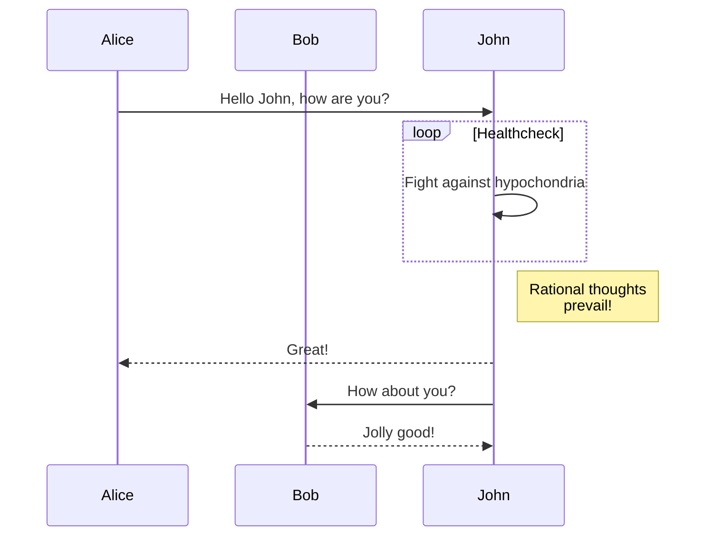
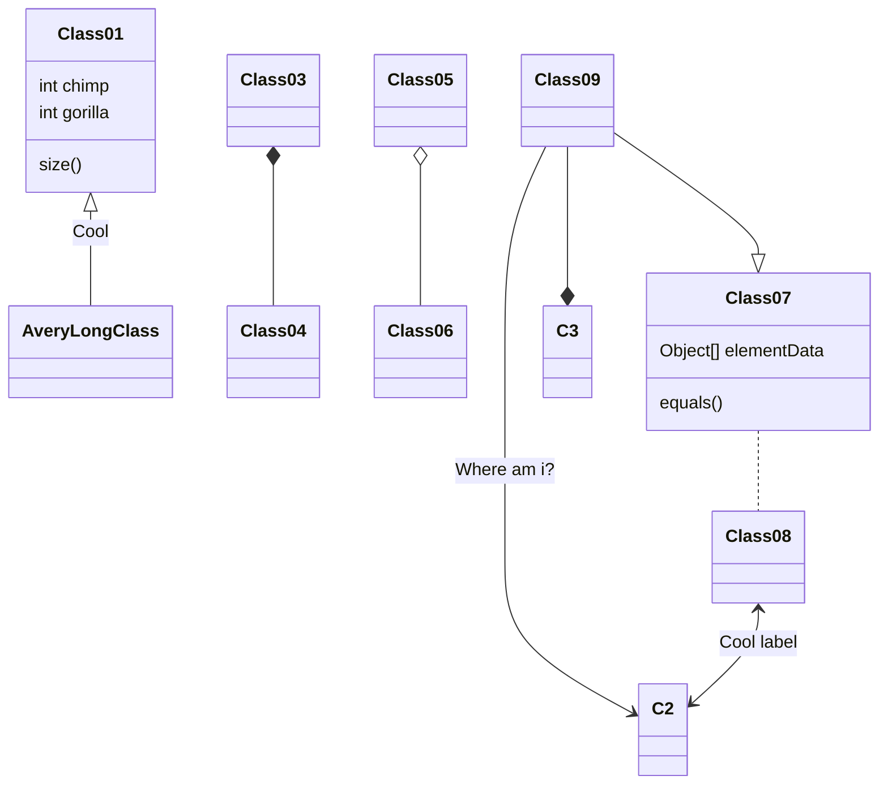

# Architecture

---

This is automatically generated template by TechDocs.

**Please fill your documentation here!**

---

Don't know where to start? 

*Option 1*: Use the [Architecture Concept Document (ACD) Template](https://github.wdf.sap.corp/DevProcess-Architecture/ArchitectureConceptDocument/blob/master/T411%20Architecture%20Concept%20Document-v4.0.md)

*Option 2*: Directly start describing your architecture as code using [Mermaid](https://mermaid-js.github.io/mermaid/#/)

> Mermaid lets you create diagrams and visualizations using text and code.
> It is a JavaScript based diagramming and charting tool that renders Markdown-inspired text definitions to create and modify diagrams dynamically.

## Flowchart

## Sequence diagram

## Class diagram

Explore it in the [live editor](https://mermaid.live/)
